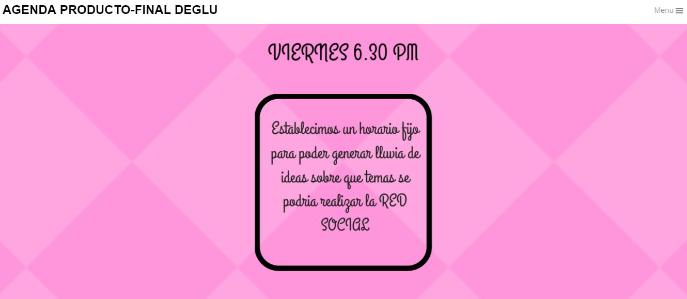

*PRODUCTO FINAL: "RED SOCIAL (DEGLU)"

Apellidos y Nombres : NEFELI JOÑORUCO Y 

**Objetivos

    Crear una red social con los siguientes requerimientos.

        . Perfiles de usuarios
        .Un newsfeed donde puedes ver las actualizaciones de todos tus contactos
        .Un lugar donde poder escribir posts
        .Un lugar para subir fotos
        .Capacidad para poder tener amigos o para poder seguir a personas/marcas dentro de         .la red social
        .Ser mobile friendly
        .Etc.

1.A continuacion se muestra la agenda donde se hizo la planificacion para poder Realizar el proyecto

[Recursos para la AGENDA](https://www.canva.com/design/DACsEGjMckk/y4nRnK1IkqY--aqZvvX0lw/view?website "PLANIFICACION").

;
_________________________________________________________________________

2.Se muestran las entrevista

3.FUNCIONALIDAD DE LA APP

4.HERRAMIENTAS UTILIZADAS
-JQUERY
-BOOSTSTRAP
-MATERIALIZE
-HTML5
-css3

