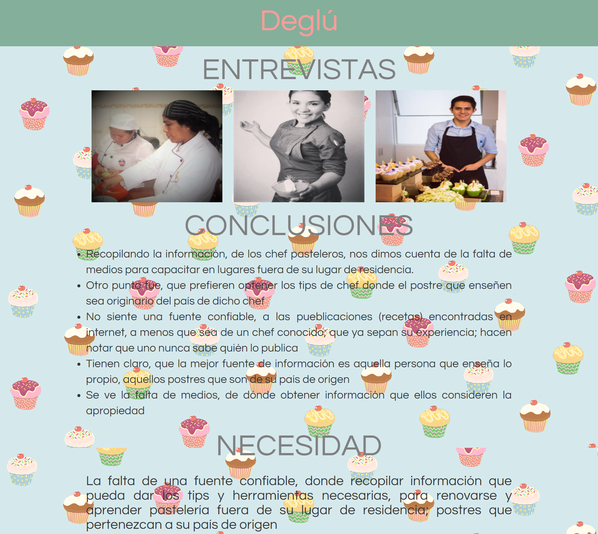
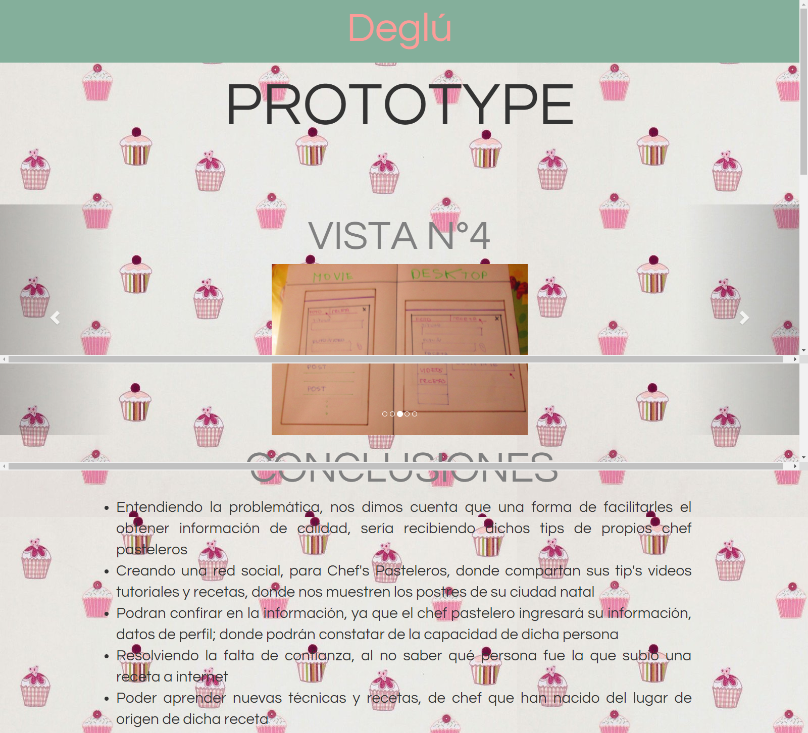

*PRODUCTO FINAL: "RED SOCIAL (DEGLÚ)"

INTEGRANTES:
            NEFELI JOÑORUCO
            MARÍA TERESA RUIZ

**Objetivos

    Crear una red social con los siguientes requerimientos.

        .Perfiles de usuarios
        .Un newsfeed donde puedes ver las actualizaciones de todos tus contactos
        .Un lugar donde poder escribir posts
        .Un lugar para subir fotos
        .Capacidad para poder tener amigos o para poder seguir a personas/marcas dentro de         
        .la red social
        .Ser mobile friendly
        .Etc.

1. A continuación se muestra la agenda dónde se hizo la planificación para poder realizar el proyecto

[AGENDA](https://www.canva.com/design/DACsEGjMckk/y4nRnK1IkqY--aqZvvX0lw/view?website "PLANIFICACION").

;
_________________________________________________________________________

2. Entrevista y definimos la problemática

[ENTREVISTA (haciendo click en la foto) Y CONCLUSIONES](https://mariaruizq.github.io/entrevistas/).

;
_________________________________________________________________________

3.Prototype, y definimos la funcionalidad

[PROTOTYPE](https://mariaruizq.github.io/prototype-degl-n/).

;
_________________________________________________________________________

4.HERRAMIENTAS UTILIZADAS
-JQUERY
-BOOSTSTRAP
-MATERIALIZE
-HTML5
-css3
-Firebase
